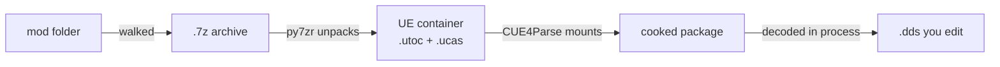

# Setup

Everything UEWalker needs beyond the Python standard library. Written for Ubuntu 24.04
and derivatives (KDE neon included); other distributions differ only in the package
manager lines.

Four pieces are involved, though only three of them are needed to walk a mod.

| Dependency                              | Why                                                                                   | Source                                                                                                                                        |
| --------------------------------------- | ------------------------------------------------------------------------------------- | --------------------------------------------------------------------------------------------------------------------------------------------- |
| `py7zr`                                 | unpacks the mod's `.7z` archives                                                      | `pip install py7zr` ([PyPI](https://pypi.org/project/py7zr/))                                                                                 |
| .NET 10 + `pythonnet` + `CUE4Parse.dll` | mounts UE containers and hands the raw mips of a cooked `Texture2D` to Python         | the [CUE4Parse](https://www.nuget.org/packages/CUE4Parse) NuGet package ([source](https://github.com/FabianFG/CUE4Parse))                     |
| Oodle                                   | decompresses UE 4.26 container data on CUE4Parse's behalf                             |                                                                                                                                               |
| `retoc`                                 | inspects containers; used by the repacker only to read a header back for verification | [github.com/trumank/retoc](https://github.com/trumank/retoc) ([releases](https://github.com/trumank/retoc/releases), prebuilt Linux binaries) |

`UERePacker.py` adds two more, and needs neither of them to walk a mod:

| Dependency    | Why                                                                            | Source                                                                                   |
| ------------- | ------------------------------------------------------------------------------ | ---------------------------------------------------------------------------------------- |
| UE4-DDS-Tools | writes an edited `.dds` back into its cooked Zen asset, resizing the mip chain | [github.com/matyalatte/UE4-DDS-Tools](https://github.com/matyalatte/UE4-DDS-Tools)       |
| UnrealReZen   | packs the result into a `.utoc` / `.ucas` / `.pak` triplet                     | [github.com/rm-NoobInCoding/UnrealReZen](https://github.com/rm-NoobInCoding/UnrealReZen) |

`repak` is optional and belongs to neither: it is needed only if a mod ships a legacy
`.pak` with no `.utoc` beside it, which retoc cannot write.

Note that retoc cannot pack for this game. Its `to-legacy` reports `packages: 0` and
writes nothing at all, even on the game's own containers, because it misreads a field in
the container header. `TOOL-PATCHES.md` covers that in full.

## What actually gets unpacked

A mod nests two different kinds of archive, and only the outer one is ever unpacked.

The `.7z` files sitting in the mod folder are unpacked by py7zr, far enough to get the
UE containers and the loose images out of them. The UE containers inside (a `.utoc`
paired with its `.ucas`, or a legacy `.pak`) are never unpacked at all: CUE4Parse mounts
them and reads packages straight out of the mount, so no cooked tree is written to disk
and no external binary is involved.



That is why retoc and repak sit outside the walk. Here they are packers, not unpackers:
they turn finished edits into a patch container, in a pass that runs long after the walk
and is not implemented yet. A walk that never gets that far never touches either one.

## 1. Python packages

```bash
pip install py7zr pythonnet
```

`pythonnet` needs a .NET runtime present at import time, so install .NET first if you
hit an error here.

## 2. .NET 10

```bash
sudo apt install dotnet-sdk-10.0
```

This is needed on Linux. The SDK builds CUE4Parse from source; the `aspnetcore-runtime-10.0`
package is the runtime `pythonnet` actually needs at import time.
If you got CUE4Parse without building, you can just install `aspnetcore-runtime-10.0` instead.

Version 10 is what current CUE4Parse targets (`net10.0`). Keep the runtime in step with
whatever your copy was built for. Check the build's
`bin/Release/` directory name if you are unsure.

Add those two exports to your shell profile; `pythonnet` locates the runtime through
`DOTNET_ROOT`.

## 3. retoc

Only the patch pass runs it, so a walk works without it; install it now anyway if you
intend to build a mod out of your edits. Prebuilt binaries are published per release. Pick the `x86_64-unknown-linux-gnu`
tarball:

```bash
mkdir -p ~/.local/bin
curl -sSL https://github.com/trumank/retoc/releases/download/v0.1.5/retoc_cli-x86_64-unknown-linux-gnu.tar.xz \
  | tar -xJ -C /tmp
install /tmp/retoc_cli-x86_64-unknown-linux-gnu/retoc ~/.local/bin/
retoc --version    # retoc_cli 0.1.5
```

Make sure `~/.local/bin` is on your `PATH`. Newer releases live at
<https://github.com/trumank/retoc/releases>.

## 4. CUE4Parse

CUE4Parse ships as a NuGet package.
NuGet is .NET's package feed, the `pip` of that ecosystem, and
the SDK talks to it for you. CUE4Parse is a DLL to be used by other .NET programs,
and it is pulled as a dependency during the .NET app building process.
Since this is a Python project, one awkward part is that a NuGet package is fetched into a
shared cache rather than into a folder you can point at, so the job here is to make the
SDK gather CUE4Parse and its dependencies into one directory of your choosing.

An empty class library does that, since a project is what NuGet installs into:

```bash
dotnet new classlib -o cue4parse-fetch
cd cue4parse-fetch
dotnet add package CUE4Parse
dotnet add package CUE4Parse-Conversion
dotnet publish -c Release -o ./CUE4Parse -p:EnableDynamicLoading=true
```

Three details make that work:

- `publish`, not `build`. It restores the packages and then copies every assembly next
  to the output. `build` leaves the dependencies in the cache and gives you a lone
  `CUE4Parse.dll`, which binds and then fails on the first type that needs one.
- `-p:EnableDynamicLoading=true`. A class library otherwise publishes without a
  runtimeconfig, and that file is what pins the .NET version to boot.
- The project's own name. `dotnet new classlib` targets whichever framework your SDK
  installs, so the versions stay consistent by themselves, and the runtimeconfig is
  named after the project.

Around 40 files land in the output directory. Two of them go into the config:
`CUE4Parse.dll` into `CUE4PARSE_DLL`, and `cue4parse-fetch.runtimeconfig.json` into
`DOTNET_RUNTIME_CONFIG`. The rest resolve automatically from that directory, so keep
them together. The `cue4parse-fetch` project itself can be deleted; recreate it when you
want a newer release, or just run the two `dotnet add package` lines again and republish.

`checktools.py` reads the published `deps.json` and names any assembly that did not make
it into the directory.

## 5. Oodle

FF7 Rebirth-era containers (UE 4.26) are Oodle-compressed, and CUE4Parse needs the
native Oodle library to read them. On Linux the file is called
`liboodle-data-shared.so` (`oodle-data-shared.dll` on Windows; older builds went by
`oo2core_9_win64.dll`).

Usually there is nothing to do here. The script always hands `OodleHelper.Initialize()`
a real path (by default beside `CUE4Parse.dll`), and CUE4Parse downloads an open-source
Oodle build from [OodleUE](https://github.com/WorkingRobot/OodleUE) into it on first use,
then reuses that copy. This needs network access once.

The path matters: `Initialize` is overloaded on a string and on an `Oodle` instance, and
a null selects the second, quietly installing an empty decompressor. Containers then read
as corrupt much later on, so the script checks that a library really was loaded.

For an offline machine, fetch `gcc-x64-release.zip` from the OodleUE releases page
yourself, extract `liboodle-data-shared.so`, and point the global at it:

```python
OODLE_LIB = "/path/to/liboodle-data-shared.so"
```

The library shipped with the game or with an FF7R modding toolkit works equally well.

## 6. The game's global container

An IoStore package stores its script-object table in the game's `global.utoc`, not in
the container that ships it, so a mod container cannot be decoded on its own. Point
`GAME_PAK_DIR` at the game's `Content/Paks` folder:

```python
GAME_PAK_DIR = "/path/to/FINAL FANTASY VII REBIRTH/End/Content/Paks"
```

Only `global.utoc` and `global.ucas` are ever read (about 2 MB together); the rest of
the folder is left alone and never indexed. Leaving this as `None` is allowed: legacy
`.pak` mods still decode, while IoStore ones report `global data is missing` per asset.

## 7. repak (optional)

Only if a mod contains a `.pak` with no matching `.utoc`:

```bash
curl -sSL https://github.com/trumank/repak/releases/latest/download/repak_cli-x86_64-unknown-linux-gnu.tar.xz \
  | tar -xJ -C /tmp
install /tmp/repak_cli-x86_64-unknown-linux-gnu/repak ~/.local/bin/
```

## 8. The repacker's tools

Only needed to run `UERePacker.py`. Skip both if you are just walking a mod.

UE4-DDS-Tools is pure Python and is used as a library, so only its `src` directory
matters. The bundled `texconv` shared library is never loaded here, because it is only
reached for sources that are not already `.dds`.

```bash
git clone --depth 1 --branch v0.6.1 \
  https://github.com/matyalatte/UE4-DDS-Tools.git ~/Programs/Mo/UE4-DDS-Tools
```

UnrealReZen has to be built, and it has to be built from a patched checkout: a stock one
misreads this game's container header and silently writes a container that declares no
packages at all. `patches/` holds the two diffs and `TOOL-PATCHES.md` explains each change.

```bash
git clone https://github.com/rm-NoobInCoding/UnrealReZen.git /tmp/UnrealReZen
cd /tmp/UnrealReZen
git checkout bf9e8de4abb63b80267f3895bbb83e8b86f53df5     # what the patches are cut against
git submodule update --init --depth 1 --recursive external/CUE4Parse
git apply /path/to/UEWalker/patches/unrealrezen.patch
git -C external/CUE4Parse apply /path/to/UEWalker/patches/cue4parse.patch
dotnet publish UnrealReZen/UnrealReZen.csproj -c Release -r linux-x64 \
  --self-contained false -o ~/Programs/Mo/UnrealReZen
```

Pin the commit. The patches touch four files in UnrealReZen and one in CUE4Parse, and a
later upstream change to any of them makes `git apply` fail.

It fetches its own zlib-ng on first run and writes it beside the executable, so the
output directory has to stay writable.

## 9. Point the script at everything

Edit `UEWalkerConfig.py`:

```python
SOURCE_ROOT_DIR = "/path/to/mod"
EDIT_ROOT_DIR   = "/path/to/output"
RETOC_PATH      = "retoc"                                   # or an absolute path
REPAK_PATH      = "repak"
CUE4PARSE_DLL   = "/home/you/Programs/CUE4Parse/CUE4Parse.dll"   # a publish output; `~` is not expanded
GAME_PAK_DIR    = "/path/to/game/End/Content/Paks"          # read only for global.utoc/.ucas
BACKUP          = False                                     # True keeps a backup- copy of each edit
SKIP_EXISTING   = True                                      # resume: skip what EDIT_ROOT_DIR already holds
OODLE_LIB       = None                                      # None = let CUE4Parse fetch it
AES_KEY         = None                                      # mod containers are normally plain
RETOC_VERSION   = "UE4_26"
UE_VERSION      = "GAME_UE4_26"
DOTNET_RUNTIME_CONFIG = "/home/you/Programs/CUE4Parse/cue4parse-fetch.runtimeconfig.json"
```

`DOTNET_RUNTIME_CONFIG` matters when more than one .NET runtime is installed (having
both 8.0 and 10.0 side by side is common): it tells `pythonnet` which version to boot
instead of letting it guess. The file sits beside `CUE4Parse.dll` in the build output.

## 9. Verify

```bash
python checktools.py                  # every dependency, in the order the walk hits them
python checktools.py /path/to/x.utoc  # plus a real mount and decode
python UEWalker.py
```

`checktools.py` prints one `ok` / `FAIL` / `skip` line per dependency and exits with the
number of failures. It round-trips a small archive through py7zr, inspects the .NET
layout before any CLR boot (hosting runtime present, publish output complete), then
loads CUE4Parse and resolves the configured `EGame` member. retoc and repak are checked
too, but as skips: neither is on the walk's path.

The lighter check `require_tools()` runs automatically at the start of every walk, so a
misconfigured path fails immediately rather than halfway through a mod.

## Verification status

The CUE4Parse side is confirmed against a built assembly and a real mod, decoding 567
textures to valid BC1 DX10 `.dds` files with matching sidecars. That is the whole read
path: the walk mounts each container through CUE4Parse and unpacks nothing. Saving the
cooked source of an edited texture goes through the same provider (`TrySavePackage`,
one package at a time), and is confirmed on a real container to return the Zen
`.uasset` and `.ubulk` chunks intact.

`retoc` is confirmed present and working against release v0.1.5, and one rough edge is
already known for the patch pass to deal with. Mod containers often carry a
`ContainerHeader` retoc cannot parse; `to-legacy` then writes nothing at all without
reporting a failure, and supplying the game's `global.utoc` does not help. Packing edits
back into such a container will have to go through `unpack-raw` / `pack-raw` instead.
